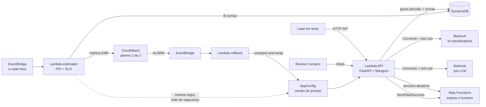

# Prumo

[](https://github.com/LucasDEVBA/prumo/actions/workflows/ci.yml)

**A taxa real de acerto de uma IA em produção, medida com poucos rótulos humanos, com rollback automático do prompt quando a qualidade cai.**

Python 3.12 · FastAPI · AWS (Bedrock, Lambda, Step Functions, AppConfig, CloudWatch, DynamoDB, CDK) · Prediction-Powered Inference

> *English summary at the end.*

---

## O problema

Quem coloca IA em produção costuma usar **uma segunda IA para conferir a primeira**: o "juiz LLM". Ele é barato e confere 100% das decisões, mas **erra sempre para o mesmo lado**, como uma balança que marca 2 kg a mais.

O caso perigoso: alguém troca o prompt, a IA passa a errar mais e **nada quebra**. Nenhuma exceção, nenhum alerta. O painel do juiz continua dizendo "91% de acerto" enquanto o acerto real caiu para 76%.

## Como o Prumo resolve

1. **A IA decide.** Um agente classifica cada lead como QUENTE, MORNO ou FRIO, usando a versão de prompt publicada.
2. **O juiz confere tudo.** Outro modelo avalia 100% das decisões.
3. **Pessoas revisam uma amostra aleatória.** Algumas dezenas por hora, via Step Functions com pausa para o humano.
4. **A estatística corrige.** A amostra mede quanto o juiz erra, e o Prumo desconta esse erro da nota dele (Prediction-Powered Inference). O resultado é a taxa real **com uma faixa de confiança**.
5. **O alarme decide.** Se a faixa inteira ficar abaixo da meta (o SLO, 85%) em duas leituras seguidas, um alarme do CloudWatch dispara e o prompt **volta sozinho** para a versão anterior. O estimador horário aplica a mesma regra como rede de segurança, e a troca é *compare-and-swap*: nunca volta duas versões de uma vez.

É a lógica da pesquisa eleitoral: uma amostra bem escolhida dá o resultado com margem de erro, sem perguntar para todo mundo.

## Resultado

`prumo bench` simula 10 cenários por linha. Em cada um, a v1 fica no ar, depois a **v2 piora a IA de 92% para 76%** (enquanto o juiz continua dizendo ~91%), e depois a **v3 melhora** a IA para 93%.

| Método | Rótulos/hora (de 400 decisões) | v2 detectada | Horas até o rollback (mediana) | Rollbacks indevidos da v3 |
|---|---|---|---|---|
| `ppi_cs` (padrão) | 10 | 10/10 | 28 h | 0/10 |
| `ppi_cs` (padrão) | 20 | 10/10 | 17 h | 0/10 |
| `ppi_cs` (padrão) | 40 | 10/10 | 11 h | 0/10 |
| `ppi_ci` | 10 | 10/10 | 14 h | 0/10 |
| `ppi_ci` | 20 | 10/10 | 5 h | 0/10 |
| `ppi_ci` | 40 | 10/10 | 4 h | 0/10 |

Um monitor que olhasse só o juiz **nunca alarmaria**: a nota dele mal se mexe.

### Teste real na AWS

Com a stack implantada numa conta AWS (us-east-1), enviei **30 leads sintéticos** pela API. O gerador conhece a resposta certa de cada um, então dá para comparar o que o juiz disse com a verdade:

| | Resultado |
|---|---|
| Classificador (Amazon Nova Lite) — acerto real | **60%** (18 de 30) |
| Juiz LLM (Amazon Nova Pro) — o que ele aprovou | **70%** (21 de 30) |
| Classificações erradas que o juiz deixou passar | **4** |
| Erros HTTP / tempo por lead | 0 / ~2,6 s |

O juiz foi otimista em 10 pontos: exatamente o viés que o Prumo existe para medir e descontar. A amostra é pequena (30), então o número serve como demonstração, não como avaliação dos modelos. O juiz padrão do código é o Claude Haiku 4.5 (família diferente do classificador); nessa conta foi usado o Nova Pro porque os modelos da Anthropic exigem um formulário de caso de uso antes do primeiro uso (`-c judgeModel=` troca o modelo no deploy).

**Por que o padrão é o método mais lento?** O `ppi_ci` usa um intervalo de confiança comum, que vale para **uma** consulta. O Prumo consulta a cada hora, e a cada consulta a chance de alarme falso cresce. O `ppi_cs` usa uma **sequência de confiança**, que continua válida mesmo consultada para sempre. É mais lento para detectar, mas a garantia contra alarme falso é real. Os testes provam isso por simulação (veja abaixo).

## Rodando localmente (sem AWS, sem custo)

```bash
uv sync --extra server
uv run prumo serve          # painel em http://127.0.0.1:8600 · API em /docs
```

O modo padrão (`PRUMO_PROVIDER=simulated`) usa leads sintéticos, uma IA e um juiz simulados com perfis de erro por versão de prompt. No painel você:

- publica a v2 e vê o juiz não perceber enquanto o Prumo detecta e reverte;
- muda quantos rótulos humanos entram por hora;
- **rotula decisões você mesmo**: seus rótulos entram na conta;
- liga e desliga o rollback automático.

Outros comandos:

```bash
uv run pytest                 # testes (inclui as simulações de Monte Carlo)
uv run pytest -m "not slow"   # só os rápidos
uv run prumo bench            # regenera a tabela acima
uv run ruff check && uv run mypy
```

## Arquitetura na AWS



| Serviço | Papel |
|---|---|
| **Bedrock** (Converse API) | IA classificadora e juiz, com saída estruturada por *tool use* e Guardrails opcional |
| **Lambda** (Python 3.12, arm64) | API (FastAPI via Mangum), estimador horário, rollback, tarefa de revisão |
| **API Gateway HTTP API** | Entrada pública com limite de requisições |
| **DynamoDB** | Decisões, rótulos e as somas por versão (atualização atômica, rótulo duplo impossível) |
| **Step Functions** | Fluxo da revisão humana com `waitForTaskToken` e expiração em 72 h |
| **AppConfig** | A versão do prompt em produção: deploy e rollback sem novo deploy de código |
| **CloudWatch** | Métricas em EMF, alarme de qualidade e *dead-man's switch* do estimador |
| **EventBridge** | Agenda o estimador e liga o alarme à Lambda de rollback |
| **CDK em Python** | Toda a infraestrutura como código ([infra/](infra)) |
| **GitHub Actions + OIDC** | CI e deploy sem chave de acesso guardada |

O passo a passo do deploy, os custos esperados e as armadilhas estão em [docs/DEPLOY.md](docs/DEPLOY.md).

## Decisões de engenharia

- **A amostra precisa ser aleatória.** Se só os casos duvidosos fossem revisados, a correção do viés do juiz ficaria enviesada. Por isso a API recusa rótulos em decisões que não foram sorteadas.
- **Somas em vez de itens.** A estimativa usa estatísticas suficientes (somas e somas de quadrados), atualizadas de forma atômica no DynamoDB. Ler a qualidade custa O(1), não O(n).
- **PPI++ no intervalo comum, PPI clássico na sequência de confiança.** O PPI++ escolhe pelos dados quanto confiar no juiz (nunca fica pior que só os humanos), mas escolher isso a cada consulta quebraria a garantia da sequência de confiança.
- **Rollback pela nossa Lambda, não pelo bake time do AppConfig.** O rollback nativo do AppConfig só vale durante a janela de deploy. Uma regressão de qualidade aparece horas depois, então quem reverte é o alarme do CloudWatch acionando uma Lambda.
- **Dois gatilhos, uma regra, troca atômica.** O EventBridge só avisa na *transição* para ALARM. Se aquela tentativa for pulada, o alarme fica parado e nenhum evento novo chega. Por isso o estimador aplica a mesma regra a cada hora. A regra exige N leituras seguidas da versão no ar desde o último deploy, e a troca é *compare-and-swap* sobre a versão medida. Assim, um alarme reentregue, um clique manual simultâneo ou os dois gatilhos juntos nunca voltam duas versões.
- **Falha no fluxo de revisão não derruba a decisão.** Se o Step Functions falha depois de a decisão estar gravada, o erro vira log `review_workflow_failed`, com métrica e alarme. Devolver 502 faria o cliente repetir o pedido e contar a decisão duas vezes na estimativa.
- **Dado pessoal expira.** O texto do lead some do DynamoDB em 180 dias (TTL); as somas da estimativa ficam. O token de administrador fica no Secrets Manager e é lido no cold start, nunca em variável de ambiente.
- **Métrica por EMF.** O estimador imprime uma linha JSON e o CloudWatch a transforma em métrica, sem chamada de API e sem custo de `PutMetricData`.
- **Portas e adaptadores.** Os serviços dependem de interfaces (`src/prumo/ports.py`). A mesma lógica roda com implementações em memória (local e testes) ou na AWS.

## Estrutura

```
src/prumo/
  stats/        PPI, PPI++, sequências de confiança, SLO e regra de rollback
  domain/       modelos, erros, IDs (UUIDv7)
  services/     decisões, revisão humana, qualidade e rollback
  adapters/     memória, simulado e AWS (Bedrock, DynamoDB, AppConfig, Step Functions)
  api/          FastAPI, painel, middlewares (correlation id, CSP, rate limit)
  lambdas/      handlers: api, estimador, rollback, tarefa de revisão
  simulation/   simulador e benchmark
  data/         gerador de leads sintéticos e a rubrica (o gabarito)
infra/          CDK em Python
tests/          unitários, propriedades (Hypothesis), Monte Carlo e integração
```

## Testes

- **Cobertura do intervalo por Monte Carlo:** em 400 simulações, a faixa de 95% contém a taxa real entre 92% e 98% das vezes.
- **Validade no tempo:** a sequência de confiança é consultada a cada hora por 30 horas, em 300 simulações, e erra no máximo α + 2%.
- **Eficiência:** com um juiz bom, a faixa do PPI fica pelo menos 20% mais estreita que a faixa feita só com os humanos.
- **Propriedades (Hypothesis):** a estimativa fica sempre em [0, 1] e ordenada, e todo lead sintético é lido de volta igual.
- **Ponta a ponta:** a v2 é revertida enquanto a nota do juiz fica acima da meta, e a v3 nunca é revertida.
- **Adaptadores AWS:** testados com `botocore.stub.Stubber`, sem rede e sem credenciais.

## Limitações

- Os dados são sintéticos e o revisor do simulador tem um ruído fixo de 1%. O próximo passo é medir o ruído humano real com 2 ou 3 pessoas rotulando os mesmos 200 a 300 itens.
- O teste de alarme falso usa uma versão claramente melhor que a meta. Falta um cenário com uma versão bem perto da meta, onde o `ppi_ci` deve alarmar à toa e o `ppi_cs` não.
- A garantia da sequência de confiança é assintótica: vale bem a partir de algumas dezenas de rótulos, por isso há um mínimo de 30 antes de qualquer decisão.
- O núcleo estatístico reimplementa métodos publicados. Bibliotecas como `ppi_py` servem de referência para validação.
- Se o processo cair entre criar uma versão hospedada no AppConfig e implantá-la, a trava otimista recusa novos deploys até alguém implantar ou apagar essa versão. É o lado seguro (recusar em vez de sobrescrever), mas ainda não há recuperação automática.
- O teste real na AWS usou 30 leads: suficiente para demonstrar o viés do juiz, pequeno demais para avaliar os modelos.

## Referências

- Angelopoulos, Bates, Fannjiang, Jordan & Zrnic. *Prediction-powered inference*. Science, 2023.
- Angelopoulos, Duchi & Zrnic. *PPI++: Efficient prediction-powered inference*, 2023.
- Waudby-Smith, Arbour, Sinha, Kennedy & Ramdas. *Time-uniform central limit theory and asymptotic confidence sequences*. Annals of Statistics, 2024.

---

## English summary

Prumo measures the **real accuracy of an LLM in production**. An LLM judge reviews every decision but is systematically biased. A small random sample of human labels measures that bias and corrects the judge's score (prediction-powered inference), producing an estimate with an **anytime-valid confidence sequence**. When the whole interval falls below the SLO for two consecutive hourly reads, a CloudWatch alarm triggers a Lambda that **rolls the prompt version back** in AppConfig.

In simulation, a regression from 92% to 76% accuracy, which the raw judge score barely registers (~91%), is caught 10/10 times with zero false rollbacks on a better prompt. Deployed on AWS with real models, 30 synthetic leads showed the same effect: Amazon Nova Lite was right 60% of the time while the Nova Pro judge approved 70%, letting 4 wrong classifications through. Built with Python 3.12, FastAPI, Bedrock (Converse + tool use), Lambda, Step Functions (`waitForTaskToken`), AppConfig, CloudWatch EMF, DynamoDB and AWS CDK in Python.
